<div align="center">


<h1>Insurance LZ</h1>

<p><strong>The Institutional-Grade Platform for Secure, Compliant, and Scalable Cloud Foundations for Regulated Insurance Enterprises.</strong></p>

[]()
[]()
[]()

<br/>

> **"Trust is the ultimate insurance policy."** 
> **Insurance LZ** is an enterprise-grade platform designed to provide a secure, measurable, and highly automated foundation for global insurance operations. It orchestrates the complex lifecycle of insurance workloads—from automated claims processing and policy administration hubs to distributed broker connectivity and unified regulatory governance.

</div>

---

## 🏛️ Executive Summary

Fragmented insurance legacy systems and manual underwriting processes are strategic operational liabilities; lack of centralized insurance orchestration is a primary barrier to organizational digital agility. Organizations fail to achieve rapid product innovation not because of a lack of actuarial talent, but because of fragmented insurance standards, lack of automated fraud validation, and an inability to orchestrate insurance landing zones with operational precision.

This platform provides the **Insurance Intelligence Plane**. It implements a complete **Enterprise Insurance-as-Code Framework**, enabling Insurance and Platform teams to manage global insurance assets as first-class citizens. By automating the identification of fraudulent patterns through real-time claim analysis and orchestrating multi-region policy administration clusters, we ensure that every organizational workload—from critical claim settlement engines to routine broker portals—is secure by default, audited for history, and strictly aligned with institutional insurance frameworks.

---

## 📐 Architecture Storytelling: Principal Reference Models

### 1. Principal Architecture: Global Insurance Industry Landing Zone & Intelligence Plane
This diagram illustrates the end-to-end flow from broker connectivity and claim ingestion to automated underwriting, policy administration, and institutional insurance auditing.

```mermaid
graph LR
    %% Subgraph Definitions
    subgraph InsuranceIngress["Broker & Customer Ingress"]
        direction TB
        BrokerGateways["External Broker APIs"]
        CustomerPortals["Policyholder Portals"]
        AgencyConnect["Dedicated Agency Links"]
    end

    subgraph IntelligenceEngine["Insurance Intelligence Hub"]
        direction TB
        API["FastAPI Insurance Gateway"]
        ClaimsEngine["Automated Claims Processor"]
        UnderwriteOrch["Underwriting & Risk Orch"]
        PolicyAdmin["Global Policy Admin Hub"]
    end

    subgraph OperationsPlane["Distributed Insurance Fleet"]
        direction TB
        ActuarialNodes["Actuarial Analytics Fleet"]
        FraudDetectors["AIOps Fraud Validators"]
        BrokerSync["Broker Lifecycle Sync"]
    end

    subgraph OperationsHub["Institutional Insurance Hub"]
        direction TB
        Scorecard["Insurance Maturity Score"]
        Analytics["Claim & Underwriting Stats"]
        Audit["Forensic Insurance Metadata Lake"]
    end

    subgraph DevOps["Insurance-as-Code Framework"]
        direction TB
        TF["Terraform Insurance Modules"]
        ComplianceBot["Regulatory Guardrail Enforcer"]
        ChatOps["Claim Approval Hub"]
    end

    %% Flow Arrows
    InsuranceIngress -->|1. Submit Claim/Policy| API
    API -->|2. Process Claim| ClaimsEngine
    ClaimsEngine -->|3. Evaluate Risk| UnderwriteOrch
    UnderwriteOrch -->|4. Manage Policy| PolicyAdmin
    
    PolicyAdmin -->|5. Execute Analytics| OperationsPlane
    OperationsPlane -->|6. Notify Status| ChatOps
    API -->|7. Visualize Health| Scorecard
    
    Scorecard -->|8. Track Throughput| Analytics
    Scorecard -->|9. Record Change| Audit
    
    TF -->|10. Provision Hub| IntelligenceEngine
    ComplianceBot -->|11. Inject Guardrail| UnderwriteOrch
    Audit -->|12. Improve Pricing| ActuarialNodes

    %% Styling
    classDef ingress fill:#f5f5f5,stroke:#616161,stroke-width:2px;
    classDef intel fill:#e3f2fd,stroke:#1565c0,stroke-width:2px;
    classDef operations fill:#e1f5fe,stroke:#01579b,stroke-width:2px;
    classDef ops fill:#ede7f6,stroke:#311b92,stroke-width:2px;
    classDef devops fill:#fffde7,stroke:#f57f17,stroke-width:2px;

    class InsuranceIngress ingress;
    class IntelligenceEngine intel;
    class OperationsPlane operations;
    class OperationsHub ops;
    class DevOps devops;
```

### 2. The Insurance Workload Lifecycle Flow
The continuous path of an insurance asset from initial broker onboarding and claim submission to active securing (PCI/HIPAA), scaling, and institutional forensic auditing.

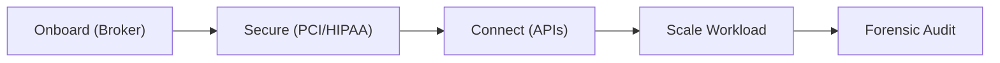

### 3. Claims Processing Pipeline Topology
Orchestrating the high-integrity flow from initial claim submission through automated fraud checks and actuarial risk assessment to final settlement, providing a unified institutional view of claims health.

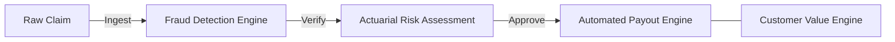

### 4. Distributed Broker & Agency Connectivity Flow
Managing the secure integration of external brokers and third-party agencies into internal insurance systems, ensuring institutional data sovereignty and partner accountability.

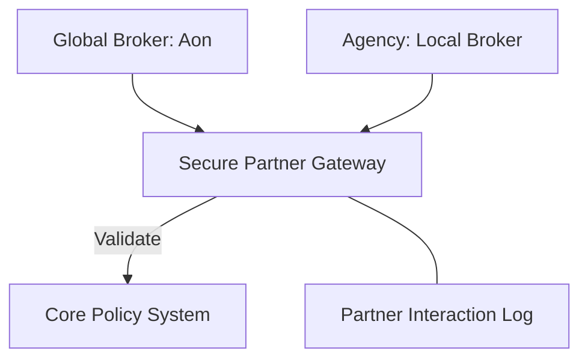

### 5. Multi-Region Policy Administration Hub
Strategically centralizing policy management across global geographic clusters (EMEA, APAC, AMER), ensuring high-availability policy administration and local data residency compliance.

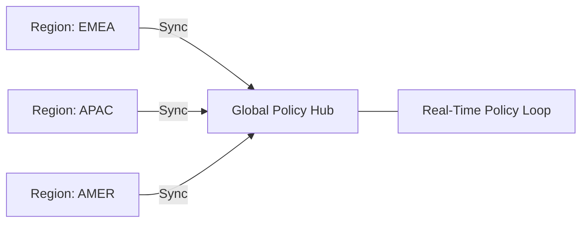

### 6. Insurance Compliance & Regulatory Guardrails Flow
Automatically enforcing industry-specific rules—including Solvency II, IRDAI, and HIPAA—directly via policy-as-code, ensuring organizational audit readiness by default.

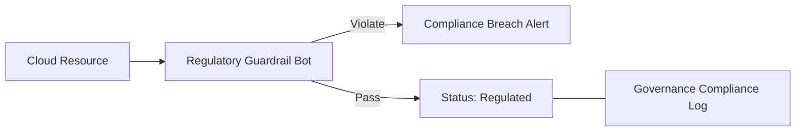

### 7. Institutional Insurance Maturity Scorecard
Grading organizational performance based on key indicators: Claim Throughput Rate, Underwriting Latency, and Regulatory Adherence Index.

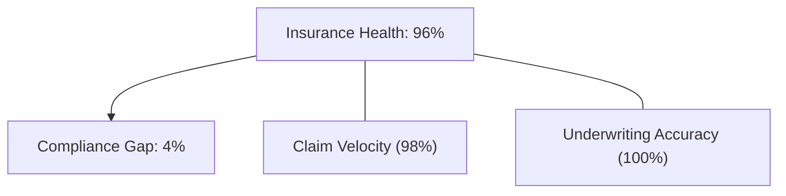

### 8. Identity & RBAC for Insurance Governance
Managing fine-grained access to sensitive policy data, claim triggers, and audit logs between Claims Adjusters, Underwriters, Brokers, and Compliance Officers.

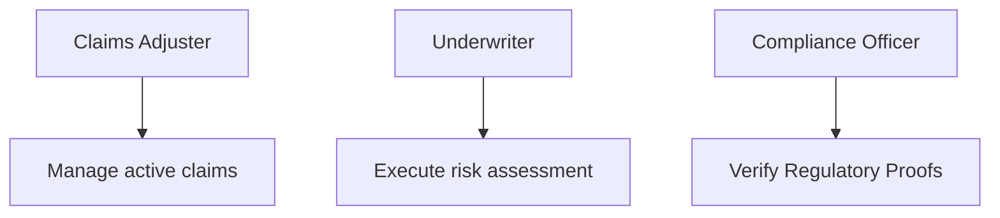

### 9. IaC Deployment: Insurance-as-Code Framework
Using modular Terraform to deploy and manage the versioned distribution of the insurance tracking hubs, analytics workers, and forensic metadata lakes.

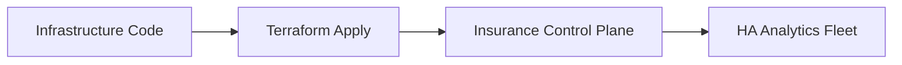

### 10. AIOps Fraud Detection & Anomaly Validation Flow
Using advanced analytics to identify suspicious claim patterns, unusual broker volume spikes, or potential internal malfeasance that could result in institutional loss.

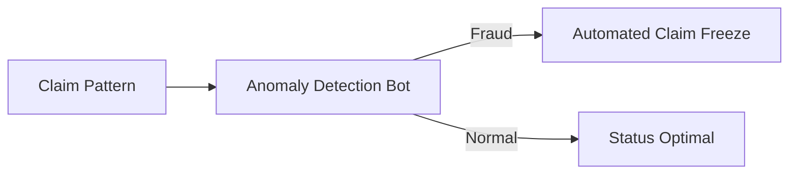

### 11. Metadata Lake for Forensic Insurance Audit
Storing long-term records of every policy change, every claim processed, and every partner interaction for institutional record-keeping, compliance auditing, and post-event forensics.

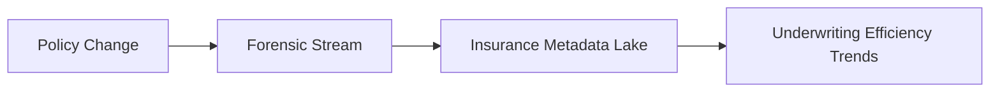

---

## 🏛️ Core Insurance Pillars

1.  **Unified Insurance Coordination**: Maximizing agility by centralizing all industry workloads through a single institutional plane.
2.  **Automated Fraud Validation**: Eliminating "toxic claims" through proactive anomaly and pattern verification.
3.  **Sequential Policy Intelligence**: Ensuring zero-interruption administration through dependency-aware multi-region synchronization.
4.  **Zero-Trust Partner Protection**: Automatically enforcing partner gateways and identity-based access across all broker integrations.
5.  **Autonomous Regulatory Logic**: Guaranteeing compliance through automated industry-specific monitoring runbooks.
6.  **Full Insurance Auditability**: Immutable recording of every policy change and claim settlement for institutional forensics.

---

## 🛠️ Technical Stack & Implementation

### Insurance Engine & APIs
*   **Framework**: Python 3.11+ / FastAPI.
*   **Analytics Hub**: Custom Python-based logic for actuarial modeling and risk calculation.
*   **Connectivity**: Integration with core insurance systems via REST/SOAP and message queues.
*   **Persistence**: PostgreSQL (Insurance Ledger) and Redis (Live Claim State).
*   **Auth Orchestrator**: Federated OIDC/SAML for least-privilege insurance management access.

### Governance Dashboard (UI)
*   **Framework**: React 18 / Vite.
*   **Theme**: Dark, Navy, Gold (Modern high-fidelity financial aesthetic).
*   **Visualization**: D3.js for broker topologies and Recharts for claim velocity analytics.

### Infrastructure & DevOps
*   **Runtime**: AWS EKS or Azure Kubernetes Service (AKS) for management plane.
*   **Compliance Hub**: Managed Policy-as-Code using Checkov and OPA.
*   **IaC**: Modular Terraform for deploying the insurance landing zone and analytics fleet.

---

## 🏗️ IaC Mapping (Module Structure)

| Module | Purpose | Real Services |
| :--- | :--- | :--- |
| **`infrastructure/ins_hub`** | Central management plane | EKS, PostgreSQL, Redis |
| **`infrastructure/gateways`** | Secure Broker & Agency APIs | API Gateway, WAF |
| **`infrastructure/analytics`** | Actuarial & Fraud compute | Spark, Python Workers |
| **`infrastructure/auditing`** | Forensic insurance sinks | S3, Athena, Quicksight |

---

## 🚀 Deployment Guide

### Local Principal Environment
```bash
# Clone the insurance platform
git clone https://github.com/devopstrio/insurance-lz.git
cd insurance-lz

# Configure environment
cp .env.example .env

# Launch the Insurance stack
make init

# Trigger a mock claim ingestion and automated underwriting simulation
make simulate-insurance
```

Access the Governance Dashboard at `http://localhost:3000`.

---

## 📜 License
Distributed under the MIT License. See `LICENSE` for more information.

---
<div align="center">
  <p>© 2026 Devopstrio. All rights reserved.</p>
</div>
