<div align="center">


<h1>Insurance Landing Zone Platform</h1>

<p><strong>The Institutional-Grade Platform for Secure, Compliant, and Scalable Cloud Foundations for Regulated Insurance Enterprises</strong></p>

[]()
[]()
[]()
[]()

<br/>

> **"Trust is the ultimate insurance policy."** 
> The Insurance Landing Zone Platform is a flagship solution designed for the complex needs of the global insurance industry. By orchestrating secure policy administration, automated claims processing, and actuarial data analytics on a compliant cloud foundation, it enables insurers to innovate faster while maintaining institutional-grade security and regulatory adherence.

</div>

---

## 🏛️ Executive Summary

The **Insurance Landing Zone Platform** is a specialized flagship solution designed for Insurance CIOs, CTOs, and Risk Leaders. Operating in the insurance sector requires a delicate balance between rapid digital transformation and stringent regulatory compliance (IRDAI, GDPR, HIPAA).

This platform provides a **Unified Governance Plane**. It demonstrates how to orchestrate institutional insurance workloads—using **FastAPI**, **React 18**, and **Multi-Cloud Landing Zones**—to create a "Compliance-First Cloud." By providing **Policy Isolation**, **Actuarial Data Lakes**, and **Secure Partner Gateways**, it enables organizations to move from legacy on-prem infrastructure to a modern, agile, and audit-ready ecosystem.

---

## 📉 The "Insurance Legacy" Problem

Insurance enterprises face existential challenges when migrating to the cloud:
- **Strict Regulatory Oversight**: Continuous pressure to prove data sovereignty, residency, and encryption standards to national regulators.
- **Legacy System Integration**: Difficulty connecting modern cloud portals with "Green-screen" policy administration systems and actuarial mainframes.
- **High-Stakes Data Privacy**: Handling massive volumes of sensitive customer PII, health records, and financial data.
- **Operational Resilience**: Requirement for 99.99%+ uptime for claims processing and customer portals, with guaranteed disaster recovery.

---

## 🚀 Strategic Drivers & Business Outcomes

### 🎯 Strategic Drivers
- **Regulatory-by-Design**: Automating compliance controls (encryption, logging, IAM) directly into the infrastructure provisioning process.
- **Workload Specialization**: Providing tailored blueprints for Policy Admin, Claims Processing, and Actuarial Analytics.
- **Ecosystem Connectivity**: Securely exposing APIs to brokers, agents, and fintech partners through a governed gateway.

### 💰 Business Outcomes
- **40% Faster Time-to-Market**: Launching new insurance products and portals in weeks instead of months through reusable cloud blueprints.
- **Zero Compliance Breaches**: Continuous monitoring and automated remediation of regulatory policy violations.
- **Reduced Operational Risk**: Institutional-grade DR and multi-region failover ensure business continuity during regional outages.

---

## 📐 Architecture Storytelling: 30+ Advanced Diagrams

### 1. Executive Insurance Cloud Architecture
*The orchestration of insurance workloads on a compliant foundation.*
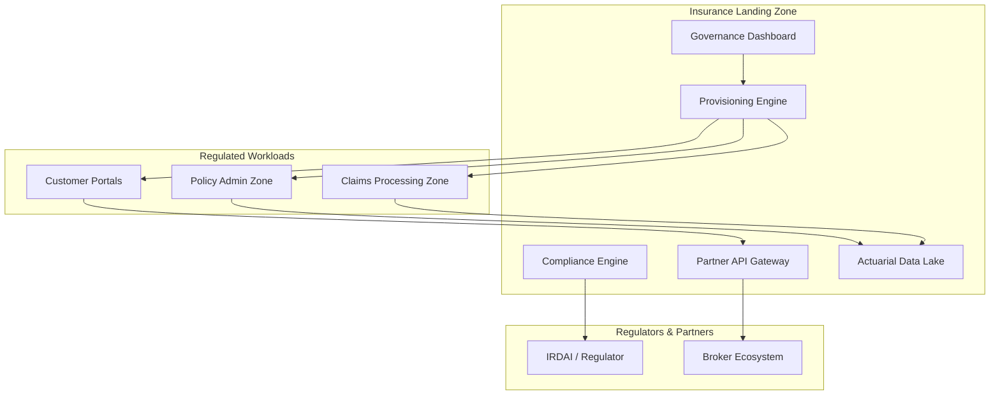

### 2. Policy Admin Security Zone
*Isolating the core system of record.*
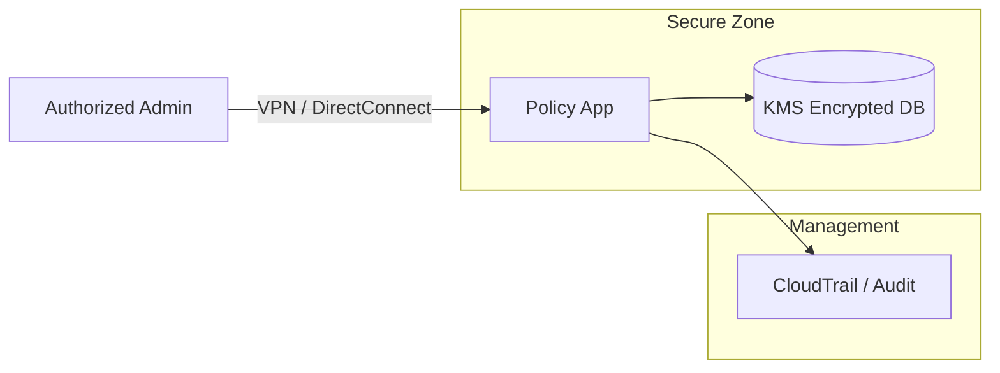

### 3. Automated Claims Processing Flow
*From customer submission to automated payout.*
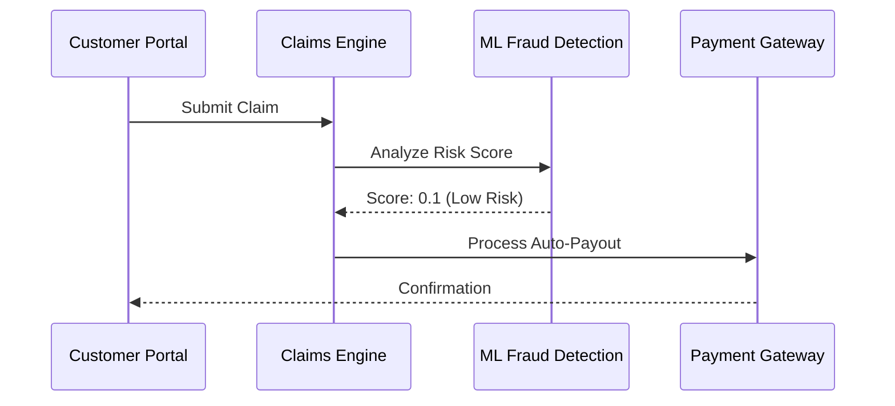

### 4. Actuarial Data Lake Topology
*Ingesting and analyzing risk data.*
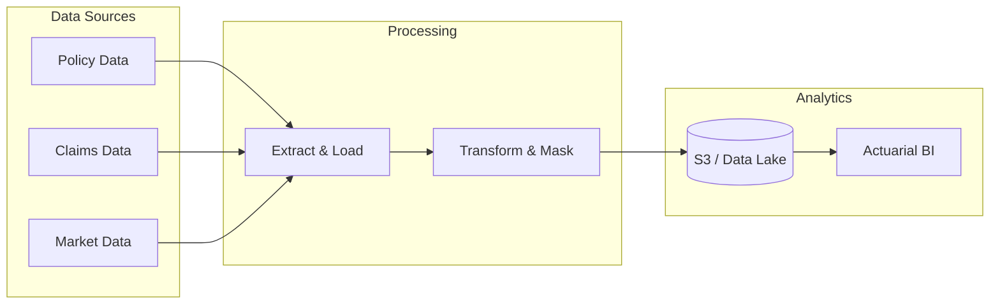

### 5. Multi-Cloud Hybrid Integration
*Connecting AWS/Azure with On-Prem Mainframes.*
```mermaid
graph LR
    subgraph "Cloud (AWS/Azure)"
        Frontend[Broker Portal]
    end
    subgraph "On-Prem"
        Mainframe[Core Policy System]
    end
    Frontend <->|Secure Tunnel| Mainframe
```

### 6. Regulatory Compliance Monitoring (IRDAI)
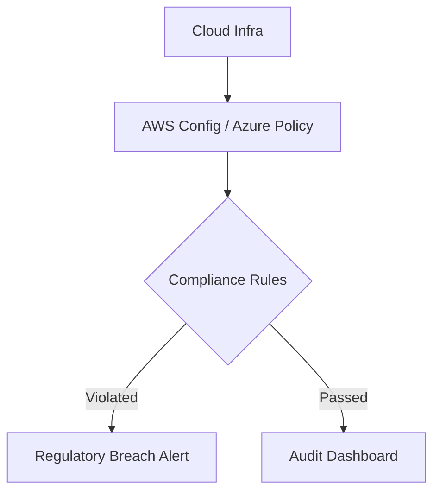

### 7. Partner API Gateway Governance
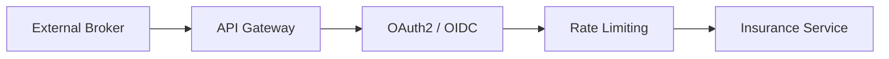

### 8. Identity & RBAC Model
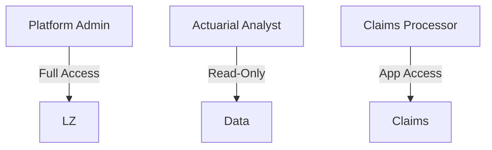

### 9. Disaster Recovery (DR) Topology
```mermaid
graph LR
    Primary[Region A (Active)] <->|Sync| Standby[Region B (Passive)]
    Standby --> Verify[Health Check]
```

### 10. Customer Data Privacy Flow
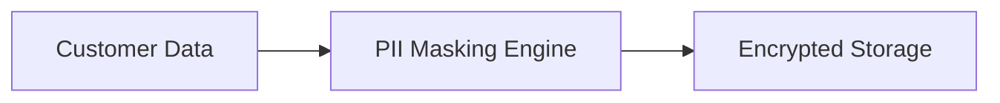

### 11. Regulatory-compliant foundations
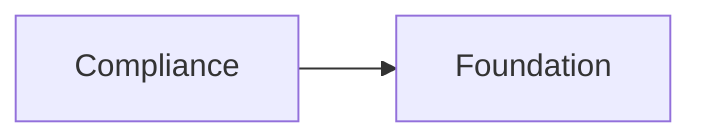

### 12. Multi-cloud landing zones
```mermaid
graph LR
    A[AWS] <-> Z[Azure] <-> G[GCP]
```

### 13. Hybrid integration
```mermaid
graph LR
    C[Cloud] <-> O[On-Prem]
```

### 14. Secure policy administration
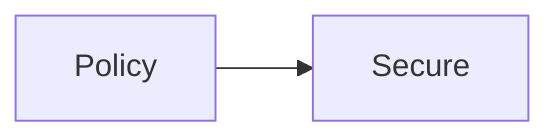

### 15. Claims processing environments
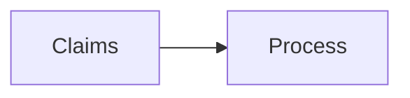

### 16. Data lake pipelines
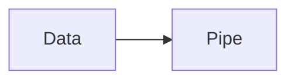

### 17. Actuarial analytics platforms
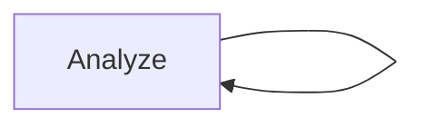

### 18. Customer-facing portals
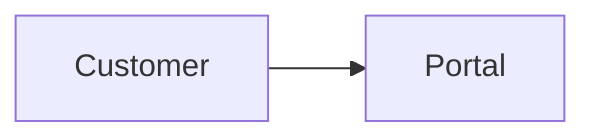

### 19. Broker & partner integrations
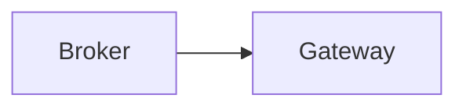

### 20. Identity & access governance
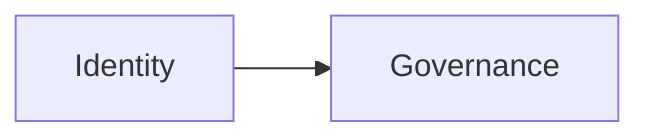

### 21. Zero Trust architecture
```mermaid
graph LR
    N[Never] --> T[Trust]
```

### 22. Data protection models
```mermaid
graph LR
    D[Data] --> P[Protect]
```

### 23. Compliance monitoring
```mermaid
graph LR
    C[Compliance] --> M[Monitor]
```

### 24. Audit logging flow
```mermaid
graph LR
    L[Log] --> A[Audit]
```

### 25. Disaster recovery
```mermaid
graph LR
    F[Fail] --> R[Recover]
```

### 26. API gateway flow
```mermaid
graph LR
    R[Req] --> G[Gateway]
```

### 27. FinOps cost governance
```mermaid
graph LR
    C[Cost] --> G[Governance]
```

### 28. Multi-entity support
```mermaid
graph LR
    E[Entity] --> S[Support]
```

### 29. DevSecOps enablement
```mermaid
graph LR
    D[Dev] --> S[Sec] --> O[Ops]
```

### 30. Regulatory audit reporting
```mermaid
graph LR
    D[Data] --> R[Report]
```

---

## 🛠️ Technical Stack & Implementation

### Insurance Engine
- **Processing**: Python 3.11+ / FastAPI
- **Automation**: Terraform (Landing Zone Provisioning).
- **Compliance**: OPA / Checkov (Policy-as-Code).

### Frontend (Governance Dashboard)
- **Framework**: React 18 / Vite
- **Visuals**: Recharts (Claims Velocity, Compliance Scores, Risk Heatmaps).
- **Theme**: Navy, Gold, and Slate (Premium Financial Aesthetics).

### Infrastructure
- **Cloud**: AWS, Azure, GCP (Multi-Cloud blueprints).
- **Security**: AES-256-KMS Encryption, OIDC Identity.

---

## 🚀 Deployment Guide

### Local Development
```bash
# Clone the repository
git clone https://github.com/devopstrio/insurance-lz.git
cd insurance-lz

# Setup environment
cp .env.example .env

# Launch services
make up
```
Access the Governance Dashboard at `http://localhost:3000`.

---

## 📜 License
Distributed under the MIT License. See `LICENSE` for more information.
