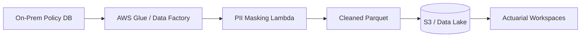
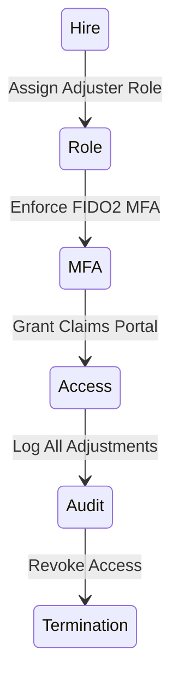

# Architecture & Workload Diagrams

## 11. Multi-Region Insurance DR Topology (Detailed)
*Ensuring zero data loss for policy systems across geographic regions.*

```mermaid
graph TD
    subgraph "Region A (Primary)"
        PA[Policy App A]
        DBA[(Encrypted DB A)]
    end
    subgraph "Region B (Secondary)"
        PB[Policy App B]
        DBB[(Encrypted DB B)]
    end
    PA <->|Sync Replication| PB
    DBA <->|Global Datastore| DBB
    Traffic[Global Load Balancer] --> PA
    Traffic -.->|Failover| PB
```

## 13. Secure Data Lake Ingestion Flow


## 20. Identity Governance for Claims Adjusters

