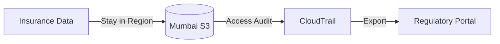
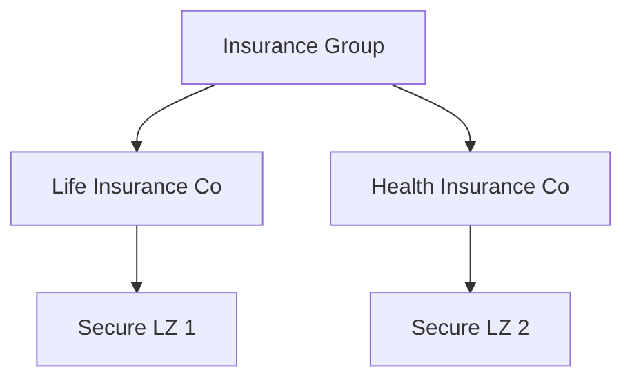
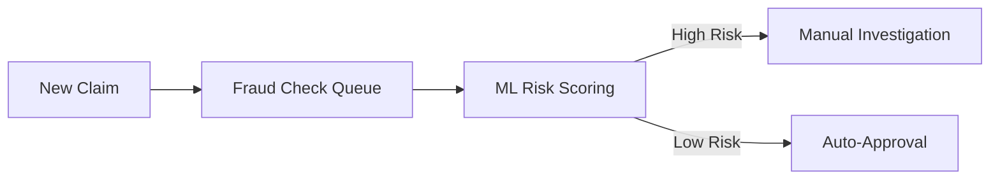

# Compliance & Regulatory Diagrams

## 31. IRDAI Data Sovereignty Model

```mermaid
graph LR
    Data[Insurance Data] -->|Stay in Region| Storage[(Mumbai S3)]
    Storage -->|Access Audit| Logs[CloudTrail]
    Logs -->|Export| Regulator[Regulatory Portal]
```

## 34. Multi-Entity Cloud Governance

```mermaid
graph TD
    Parent[Insurance Group] --> Entity1[Life Insurance Co]
    Parent --> Entity2[Health Insurance Co]
    Entity1 --> LZ1[Secure LZ 1]
    Entity2 --> LZ2[Secure LZ 2]
```

## 40. Fraud Detection Integration Model

```mermaid
graph LR
    Claim[New Claim] --> Queue[Fraud Check Queue]
    Queue --> ML[ML Risk Scoring]
    ML -->|High Risk| Manual[Manual Investigation]
    ML -->|Low Risk| Auto[Auto-Approval]
```
